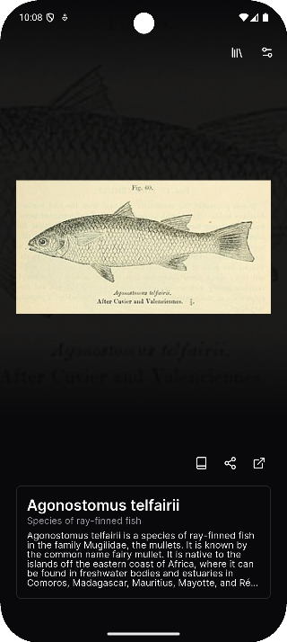
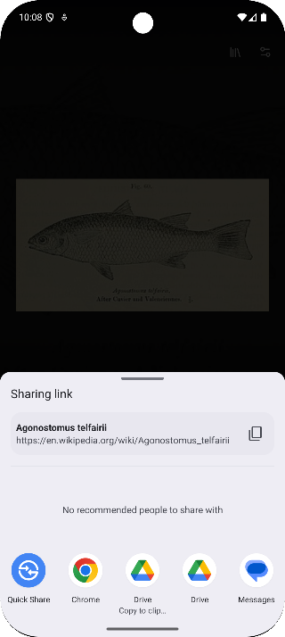
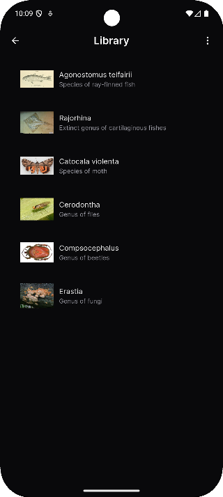
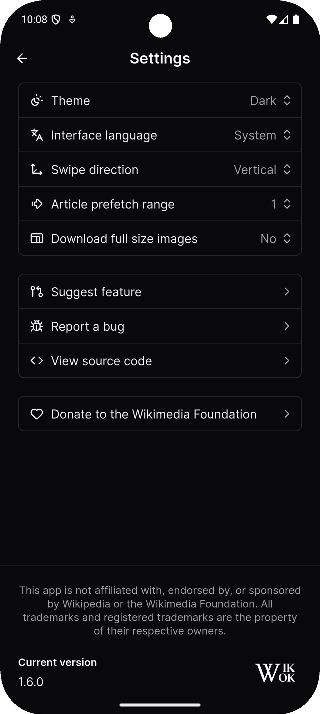

# WikWok

Doomscroll your way to endless knowledge.

## Introduction

Ever wanted to discover something new with just a swipe? This app brings the joy of spontaneous learning right to your fingertips. Whether you’re looking for a fun way to pass the time or eager to learn something unexpected, this app makes exploration effortless and exciting. Browse through randomly selected Wikipedia articles, each one a quick, engaging read designed to spark curiosity and expand your horizons.

## Showcase

## Download
[Download the latest APK here.](https://github.com/bradleyoosterveen/wikwok/releases/latest)